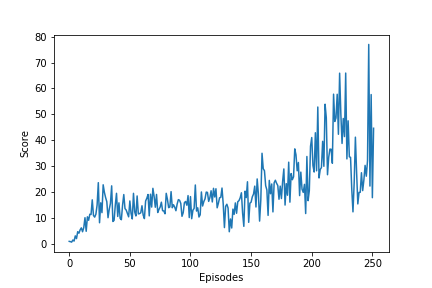

## Report "Continuous control"

### Learning algorithm (ppo_agent.py file)

- Preliminary functions :

  > The first two functions are used for computing both advantages and expected discounted returns needed in learning process. In the first one, we stock (line 16) the TD-residuals (computed at each state of the trajectory) of the set of state values "VALUES" and with discount gamma, using the formula described in the "HIGH-DIMENSIONAL CONTINUOUS CONTROL USING GENERALIZED ADVANTAGE ESTIMATION " search paper (section 'Preliminaries' equation n°6). In the second one, we used these TD-residuals values for computing (lines 27, 28, 29) the generalized advantage estimator GAE(gamma, lamda) at each time step, as described in the same paper (equations n°11,....,n°14), along with the discounted returns. After having stored all these values in tensors for futures calculations, we normalize the advantage values to prevent the values from getting too large (it make the values independent from the length of the trajectory, allowing a better learning from the agent when computing the surrogate loss).
  > The next function get_log_probs outputs a tensor containing the logarithm of the probability corresponding to each actions ( view here as random variables) performed throughout the trajectories. It will be used to compute the surrogate loss. Here instead of directly applying the log function to the whole formula of the probability density of a normal distribution, we are using the mathematical property of log that turns product into sum (this way the expression to be computed is dramatically simplified).
  > The following function will be used for collecting the trajectory. Here we are using the policy model of the agent to output the actions needed to be performed when being in the visited states.
  > The last function create the trajectory (along with all the values necessary for computing the losses) on which we are going to run our analysis during the learning process.

- "Agent" class :

  > The first attributes are some hyper-parameters that we store as class attributes just to simplify the implementation in the calculation phase (see "perform_ learning_with( )" method). 
  > The next two attributes are the policy model (outputs the best distributions for choosing the right actions (each of them consisting in four numbers corresponding to torque applicable to two joints) to performed and the critic model (outputs state value of each given state). Then we create the optimizers that will update the parameters at the very end of training using the gradient computed with the backward() method.
  > ​        The following part of the code is about the learning process. The set of experiences (buffer) is split into batches randomly generated (line 99) at each epoch. Then we extract the sub-sets that we need (lines 103-107) to get our two losses, namely advantages (line 105) + old/new policies(lines 111, 112) for surrogate loss (line 119), and returns (line 106) + old/new values(lines 107,121) for critic loss (line 127). Finally, we need to compute the gradient of the loss functions through the backward method (that propagates the error of total_loss through the entire network and computes derivatives with respect to each parameter of the model). Notice that we can combine the losses (line 130) without risking any problem because our two models (policy and critic) don't share any common parameters (that allows us to use only one computational graph which have however to be retained for enabling the second back-propagation): that way each optimizer can update only its corresponding parameters without affecting the others when calling backward() on total_loss.   

### Performance

> The environment have been solved in 252 episodes. At that point, my agent gets an average score of 30.12 (mean over last 100 episodes) . 
>
>        
>
> - Future ideas for improvement 
>
>   > When I take a look on the plot displaying the evolution of performance, I notice that despite some good progression at the very beginning of training,  my agent have hard time learning for a quite long period of time (approximately from episode 25 to 150) during which results oscillate around 15. Then the performance start to re-increase but still keeping extreme variations all along . In my opinion this unstable learning from the agent may be due to the gradient clipping that I add at the end of the code. Indeed it is unnecessary here because I chose to use normalized layers in my models (see ppo_model.py file) whose goal is to prevent the gradients from getting too small or too large (vanishing/exploding gradient problem). By adding the clipping, I may have kept the parameters (weights of models) from being updated the right way, hence hurting the learning. Another possible explanation to that bad behavior may simply come from a bad "buffer_size/batch size/learning_rate" combination. Indeed the batch normalization allow me here to use a high learning rate without risking to saturate any activation functions (keeping that way the capacity of the network to learn). But obviously my choice was not really good since that it have led to an unstable learning (high magnitude of variation between sequential episodes). Maybe I should consider decreasing the learning rate to fix that issue.  
>   >
>   > The same thing goes for my choice regarding the number of batches (determined by both buffer and batch size). Perhaps the bad performance is due to a tendency from the model of "overfitting" the training data set (namely the collected trajectory in our case). Indeed with a large batch size (meaning fewer batches of data are covered per epoch), the low diversity of analyzed data (meaning less noise brought to the model) make the model 'too strongly influenced by the current training set and unable to generalize its predictions (it results then in a bad performance of the agent when collecting a new trajectory in  the next episode). What might fix the issue here is just using a smaller batch size (the generated noise will actually improve the capacity of the algorithm to get itself out of a bad local minimum (on the graph of surrogate loss versus parameter to update) relaunching the learning process by evolving towards a better local minimum or hopefully the global minimum.    